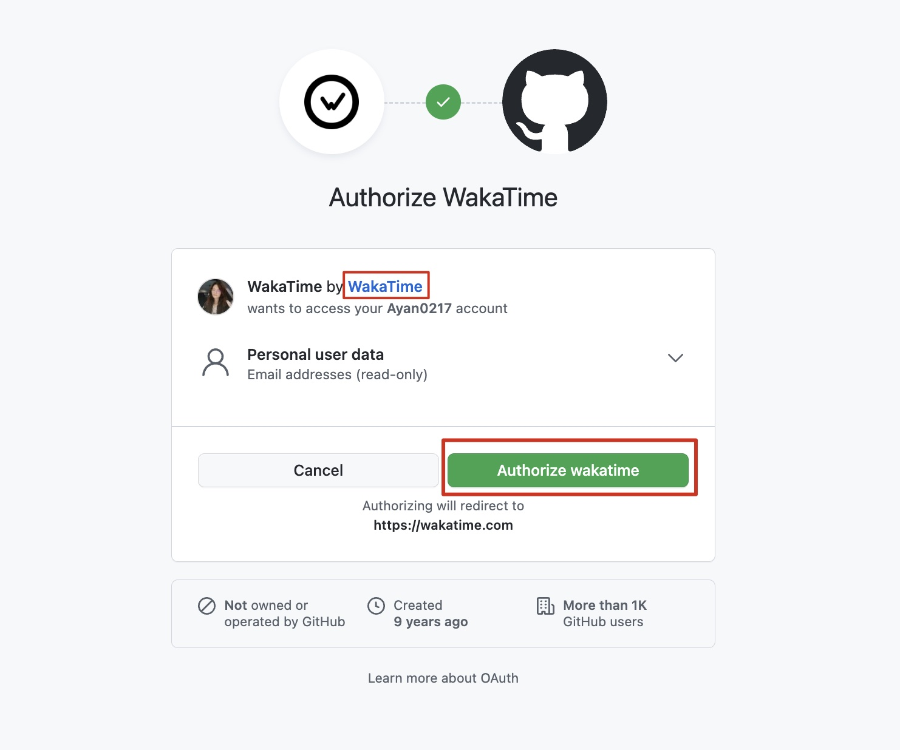
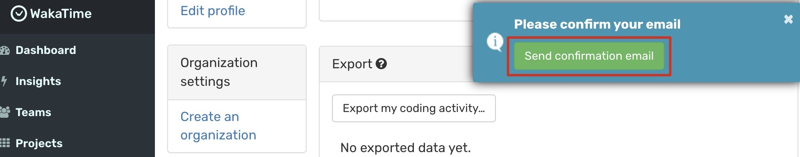
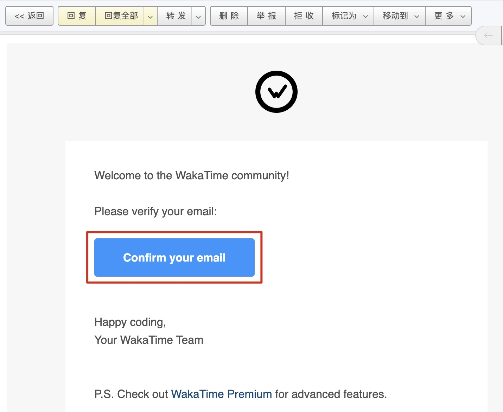
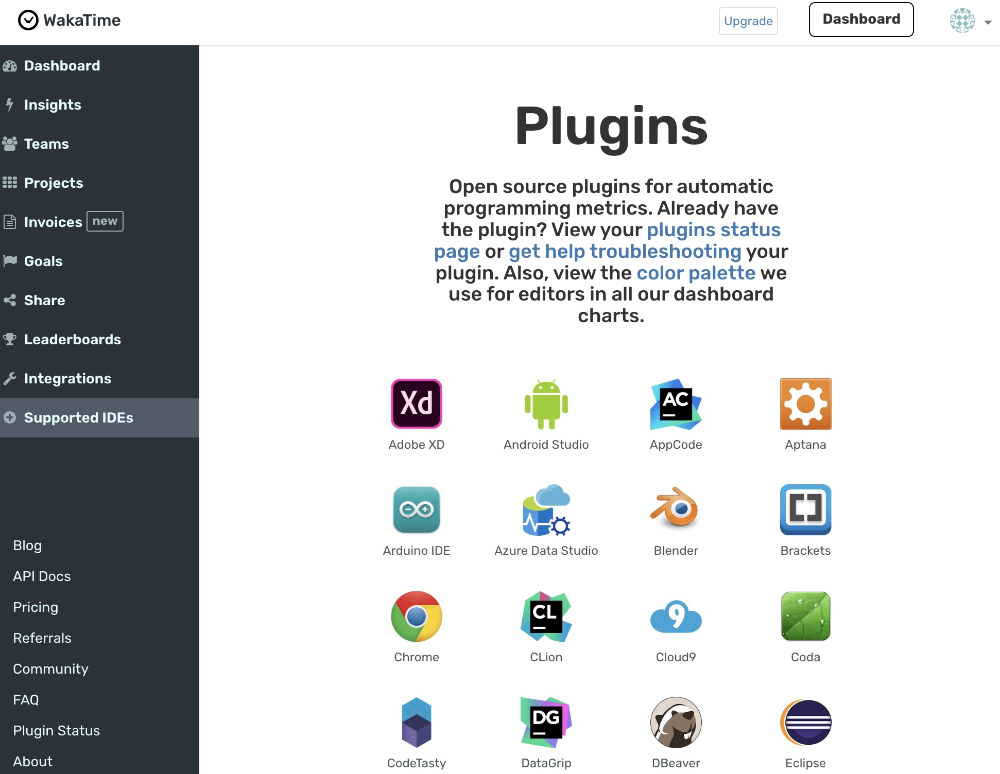
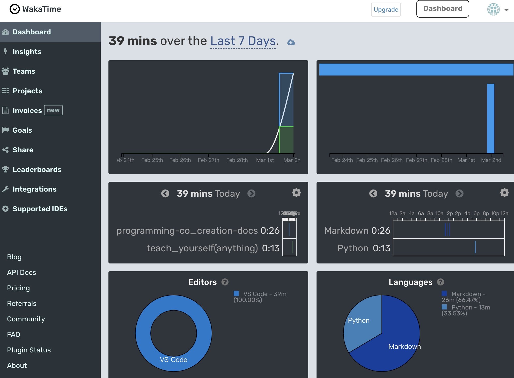
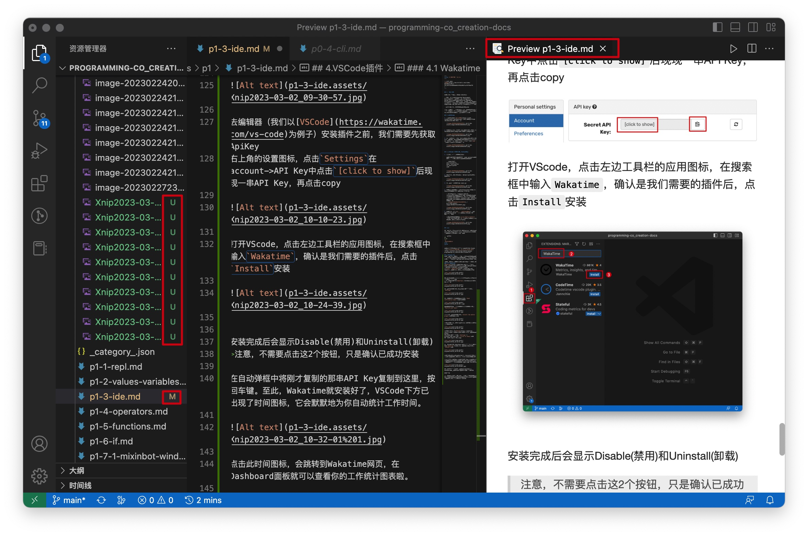
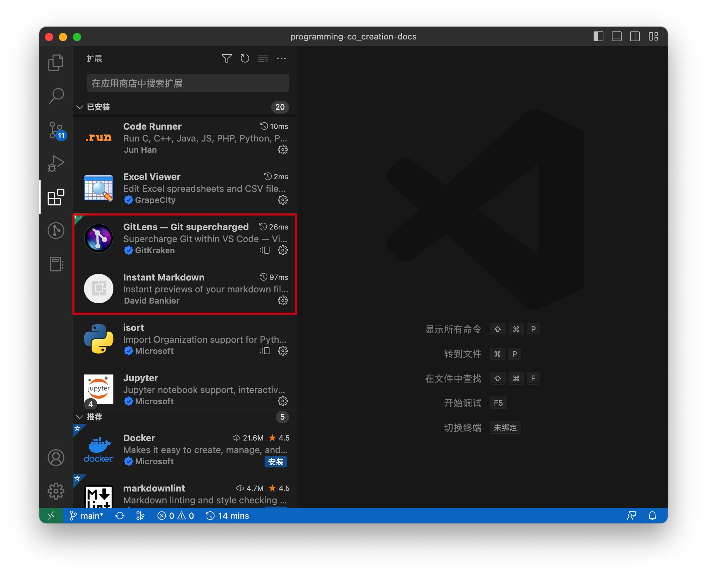

从[1-3.IDE集成开发环境](../p1/p1-3-ide.md)，我们就正式开启了使用VSCode编写代码的学习和应用。前面提到“VSCode支持很多第三方插件“，这里列出几款适合目前共学共创的插件工具供大家参考：

>大家也可以自行探索，发现好的插件请继续补充进来

### Wakatime

[Wakatime](https://wakatime.com/)是一款给程序员们解决编程工作时间自动追踪统计的工具，支持非常多的编辑器，可以点击官网了解详情。
在[Login - WakaTime](https://wakatime.com/login)注册账户，我们可以使用GitHub账号登陆。

如果GitHub账号在浏览器中是登陆状态会自动识别，点击绿色按钮进行授权
> 框出来的蓝色字体`WakaTime`是GitHub仓库，可以点击看一下

跳转到以下页面，点击右上角的设置图标，点击`Settings`

跳转页面并弹出验证邮箱提示，点击`Send confirmation email`发送验证邮件

你的邮箱会收到一封验证邮件，在验证邮件中点击`Confirm your email`

浏览器跳转到以下页面，点击`Install the editor plugin`安装编辑器插件

在这个页面中我们可以看到有非常多的编辑器都可以安装使用Wakatime

打开编辑器（我们以[VSCode](https://wakatime.com/vs-code)为例子）安装插件之前，我们需要先获取ApiKey
右上角的设置图标，点击`Settings`在account->API Key中点击`[click to show]`后现现一串API Key，再点击copy

打开VScode，点击左边工具栏的应用图标，在搜索框中输入`Wakatime`，确认是我们需要的插件后，点击`Install`安装

安装完成后会显示Disable(禁用)和Uninstall(卸载)
>注意，不需要点击这2个按钮，只是确认已成功安装

在自动弹框中将刚才复制的那串API Key复制到这里，按回车键。至此，Wakatime就安装好了，VSCode下方已出现了时间图标，它会默默地为你自动统计工作时间。

点击时间图标，会跳转到Wakatime网页，在Dashboard面板就可以查看你的工作统计图表啦。

随着你的工作时间和种类的增加，这些图表会变得非常漂亮，让你编写代码时的心情变得更愉悦，当然，最重要的是你可以用这些反馈数据做复盘等。

下图是我的VSCode界面，实现了
- 一边编辑Markdown语法一边预览Markdown渲染效果
- 清晰地看到项目中哪些文件有变化（U-git未跟踪，M-有更新）

这2个效果是通过安装`Instant Markdown`和`GitLens`插件实现的，请参考以上在VSCode安装插件的方式，自行探索安装。

可以搜索更多插件熟悉安装，安装后不合适可以随时点击Disable(禁用)或Uninstall(卸载)，欢迎分享补充好用的插件。

