# Tyopra + 截图工具的最佳实践
:::info 信息
[视频：如何使用系统自带的截图工具](https://www.bilibili.com/video/BV1fD4y1T7UC/?vd_source=08ffb5056ed58860f28c643cbea98c2d)

[视频：如何买七牛云存储空间做图床](https://www.bilibili.com/video/BV1W84y1P7pq/?vd_source=08ffb5056ed58860f28c643cbea98c2d)
:::

## 一、为什么是 Typora + 截图工具？

对于不了解 Typora 的朋友来说，您可能心中会有疑问：

**Typora + 截图工具，什么意思？Typora 是什么？它加上截图工具可以干什么？**

我试着回答这几个问题。

要讲清楚这个问题，需要先知道 Typora 是什么：

> **[Typora](https://typora.io/) 是一款知名的 markdown 阅读编辑器，它可以用来阅读和编辑 markdown.**

Typora 可以说是公认的使用体验极好的写作工具，许多知名作家都在用。

您可能听过有句传言叫做“槟榔加烟，法力无边”，这显然是瞎掰（想早点死可以这样搞）。但是文字加图片是真正的经典搭配，能让内容的表达力和表现力发挥得更加淋漓尽致，可以说“法力”确实是大大加强了。

读到这里，您可能明白了 Typora + 截图工具的最佳实践是在实践什么。

对，就是实践**生产图文内容**。

本文也将围绕这一核心——生产图文内容——来讲 Typora + 截图工具的最佳实践。

## 二、如何进行图文生产？

排版、生成目录等这些事可以依赖工具完成，人需要做的其实就是 3 件事：

1. 写 markdown 文本；
2. 截取图片，用来插入 markdown；
3. 加工截图，比如在图片上添加标记。

接下来将依次进入到这三件事，具体说明每一件应该怎么做。

### 写 markdown 文本

关于写 markdown 文本，网络上有很多成熟的教程，在这里就不赘述了。

分享一个自助学习 markdown 的站点：

> [markdown tutorial](https://www.markdowntutorial.com/zh-cn/)

点击链接会进入到学习界面，可以先把语言更改为自己国家的。接着会看到它给你的任务。你可以一边完成任务，一边你就慢慢了解了标题怎么弄、列表怎么弄等等。

### 截取图片

基于两点考虑：

* 在电脑上截图无非就是截图某一部分、某个窗口、或者截取整个屏幕；
* 反正就只有上述三种简单的截取方式，能用系统原生的截图模块，就没必要安装额外的工具。

综上，所以决定就向各位介绍怎样使用 Windows 操作系统、Mac 操作系统自带的截图工具来截图。我决定就向各位介绍怎样使用 Windows 操作系统、Mac 操作系统自带的截图工具来截图。

#### Windows 系统截图

**操作步骤：**

* 使用快捷键 `win + shift + s` 唤醒系统自带的截图模块；
* 选择截取方式：截取某个选定区域、某个窗口、或是整个屏幕；
* 鼠标左键确认截图，然后保存或删除截图。

#### Mac 系统截图

**操作步骤：**

* 使用快捷键 `shift + command + 3` 截取整个屏幕，或是 `shift + command + 4` 截取屏幕的部分；
* 如果正处于框选部分屏幕截图状态，补敲一下 space 键，会进入窗口截取模式，鼠标悬浮处的窗口会高亮；
* 截图后右下角会出现缩略图，点击进编辑以及决定是否保存。

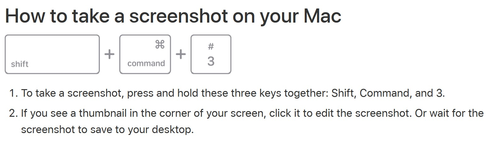

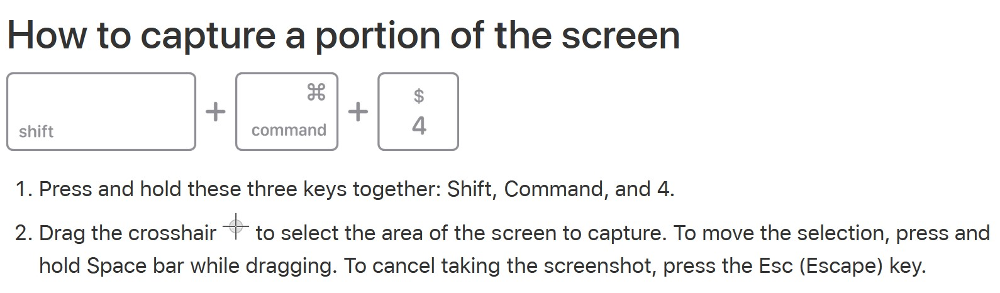

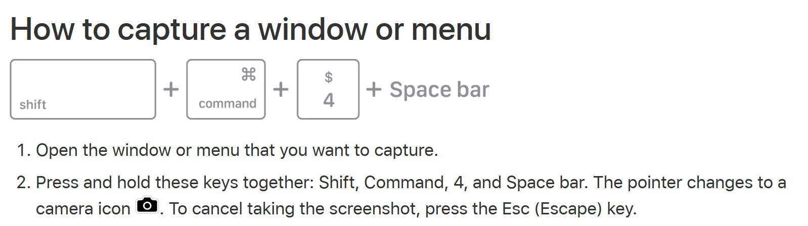

### 加工截图

这里向各位介绍一款适合 Winodws 系统使用的一体化设计工具：[PicPick](https://picpick.app/en/)

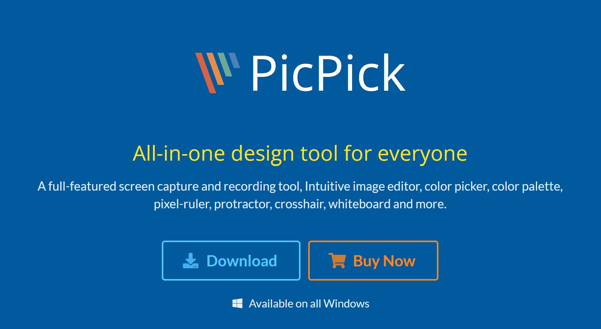

首先进入到 [PicPick](https://picpick.app/en/) 官方主页去下载安装它。

安装完成之后就可以用它来打开我们已经截取的图片，去做一些标记、或是写写画画什么的了。

关于 PicPick 的使用界面非常直观，只要会使用鼠标键盘的小伙伴，应该倒腾倒腾就会用了。

另外，我也录了视频，做了一些简单的演示，各位有兴趣可以参考参考。

### 将图片插入到 Typora

讲完了如何截图以及截图后如何做标记，现在就差把图片插入到 Typora 的文字中了。

操作其实非常简单：

* 方式一：在 Typora 中用快捷键 `ctrl + shift + i`, 然后在小括号中填入图片所在路径；
* 方式二：手动输入 `` 在小括号中填入图片所在路径；
* 方式三：在磁盘中找到图片，直接拖动到 Typora 窗口中。

但是**如果要想让我们写好的 markdown, 在被复制到别的地方时，图片依然能够正常显示，那么我们需要先配置好“图床”。**

因为如果我们的图片路径是本地磁盘，在其他设备同样的路径下是找不到它（图片）的。我的电脑 `C:/User/` 下的东西和你的电脑 `C:/User/` 下的东西肯定非常不同，是这样吧？

#### 图床的配置

**首先我们要去买一个云存储。**我选择的是七牛云，因此这里以七牛云来做演示。（参考七牛官方的[快速入门文档](https://developer.qiniu.com/kodo/1233/console-quickstart#step1)）

**注意！！：**存储区域记得选择境外的。

（因为后面要使用**「别名记录（CNAME）」**，而如果域名未备案的话，只有区域是境外才能使用「别名记录」。）

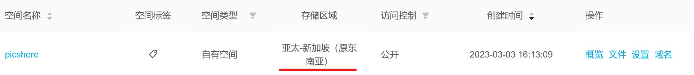

空间创建好之后，它会像上图一样出现在列表里。

接下来展开左边侧边栏，点击 **CDN**

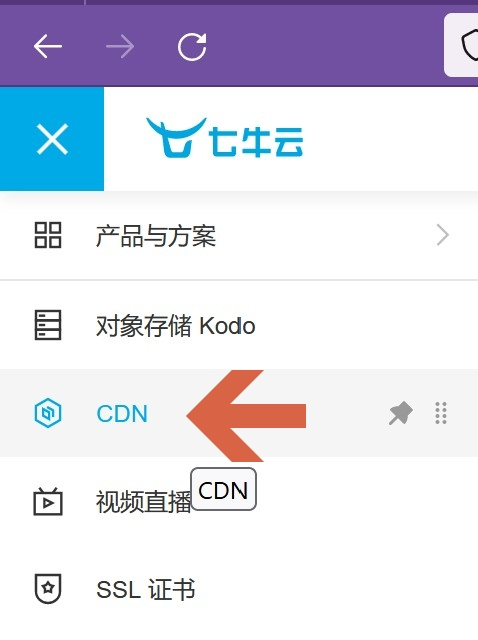

然后进入到**「域名管理」**👉 **「添加域名」**

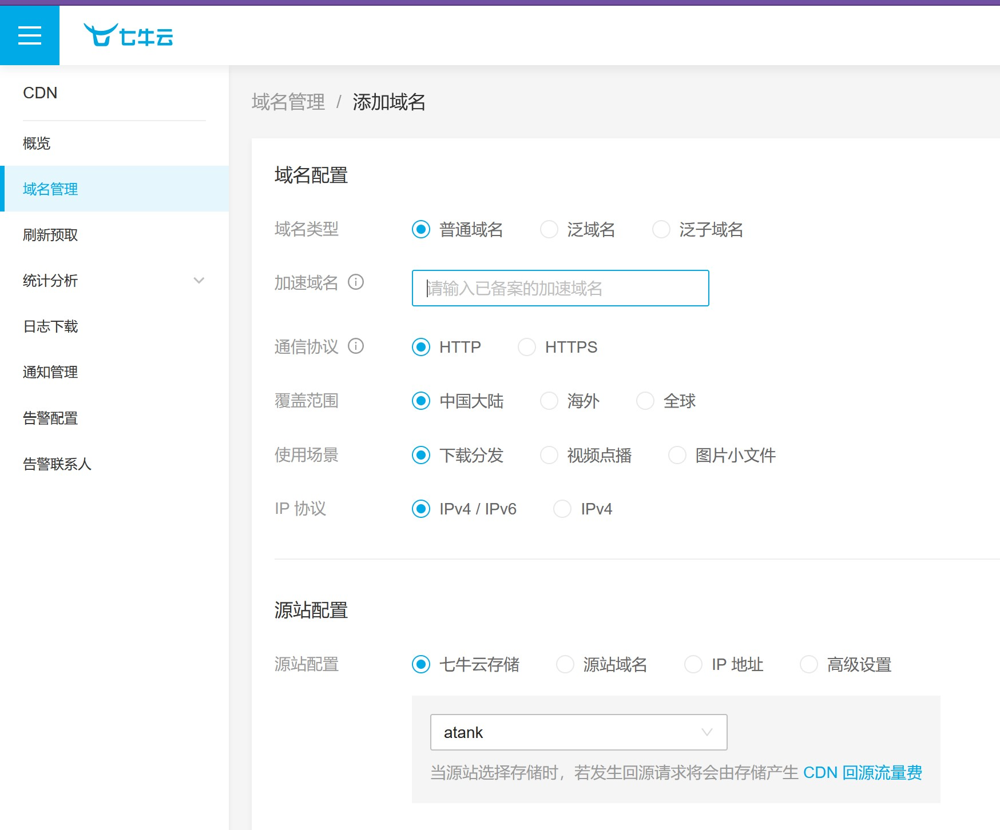

覆盖范围先改为“**海外**”；同时到这里你需要一个**已有的域名**，可以在腾讯云、阿里云或者别的哪里去注册。

我选择了到阿里云购买域名，因此本文会以阿里云来演示。

##### 💱**视角切换：**现在我们到了**阿里云**

展开左侧边栏选择**「域名」** 👉 **「域名列表」** 👉 **「域名注册」**

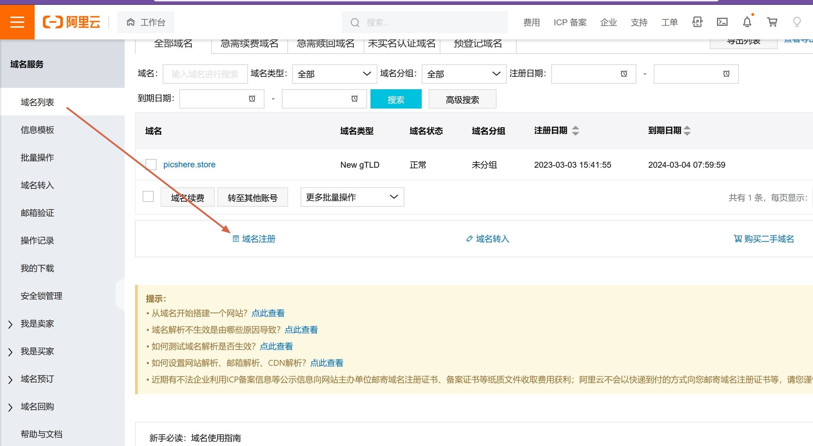

在输入栏输入想要以什么字符串作为一级域名（我的是 "**picsbed**"）. 在输入框右边选择想要的顶级域名（我选了 "store"），接下来页面里会列出一些还没有被注册，也就是你可以使用的域名，选择理想的购买就好。

选好之后点击**「域名清单」**👉 **「立即购买」**

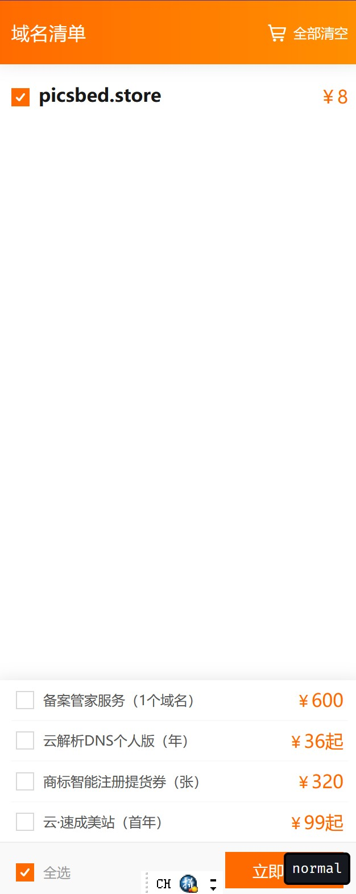

然后进入确认订单页面，选择域名持有者（**个人**或企业），选择经过实名认证的信息模板，点击**「立即购买」** 👉 **支付**。

支付完成之后，域名列表里就有了已经购买的域名信息。点击**「解析」**

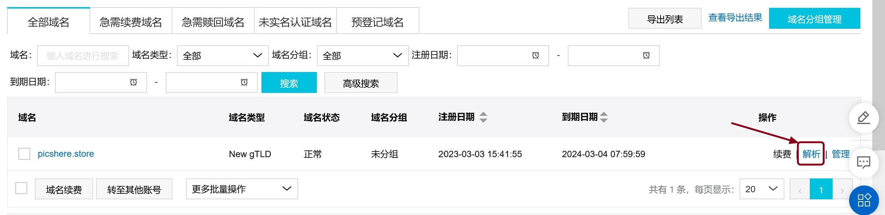

找到**「添加记录」**，点击。选择记录类型为 **CNAME（别名记录）**；添加主机记录（二级域名）：`at`（改为自己想要的）；**记录值**随便填写（后面要修改）；点击**「确认」**

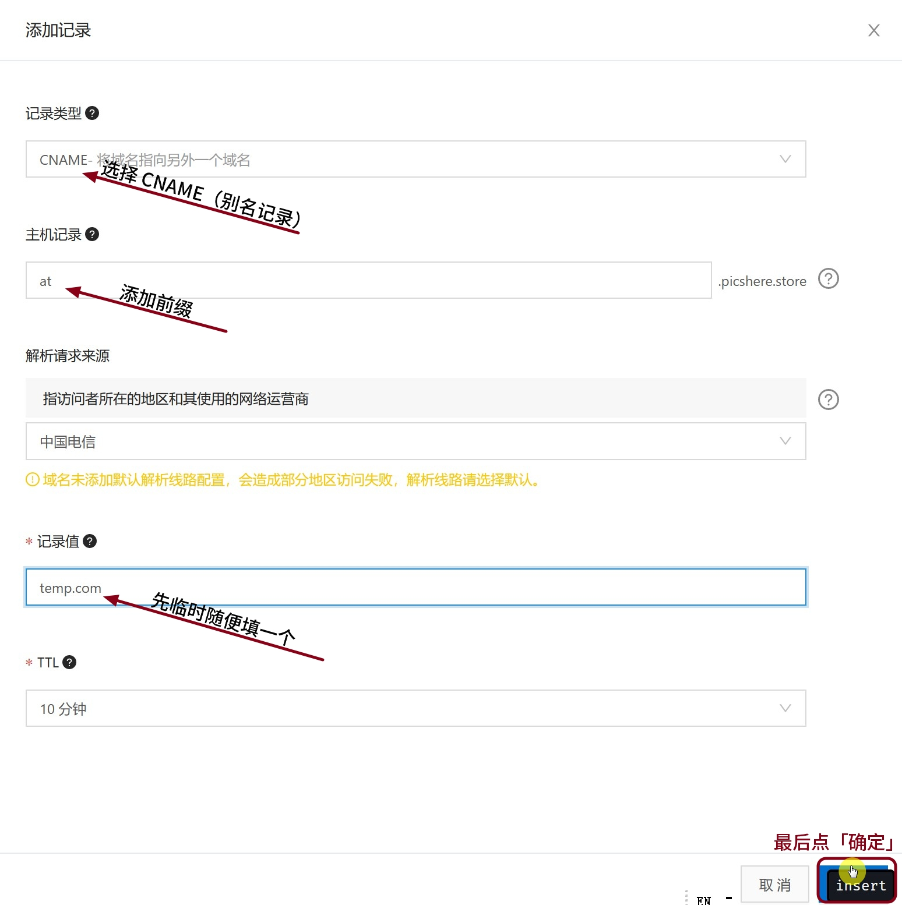

##### 💱**视角切换：**回到**七牛云**的**「域名管理」**

在加速域名里填入加了前缀的阿里买的域名：**at.picshere.store**  （覆盖范围：**海外**），点击**「创建」**按钮

再次回到**「域名管理」**，等待 **at.picshere.store** 创建成功。等待结束后鼠标悬浮到 CNAME 黄色的“**未配置**”那里，点击复制。

##### 💱**视角切换：**切回**阿里云**

将复制到的 CNAME 配置 **at-picshere-store-idvlbbt.qiniudns.com** 修改到刚才创建的记录的记录值。

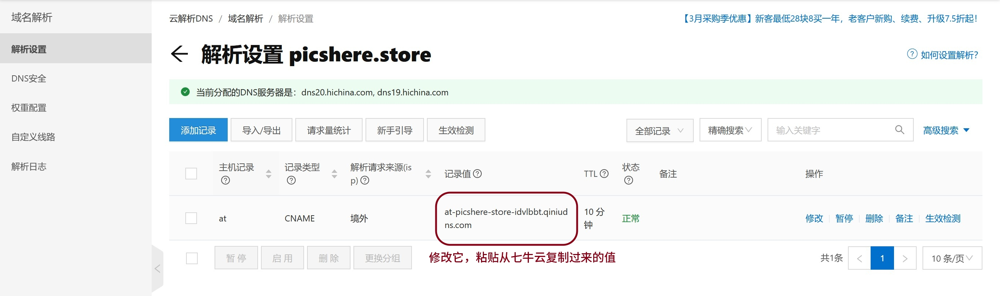

##### 💱**视角切换：**再到**七牛云**

这时按理 **CNAME** 应该是配置成功了。（可是我的不知道为什么还显示“未配置”。但是经测试不影响，图床实际上已经可以使用了。）

##### 💱**视角切换：**到 **Typora**

快捷键：`ctrl + ,` 选择**「图像」** 👉 **「下载或更新」** PicGo-Core.

同时**按图示修改，让本地位置的图片自动上传**。

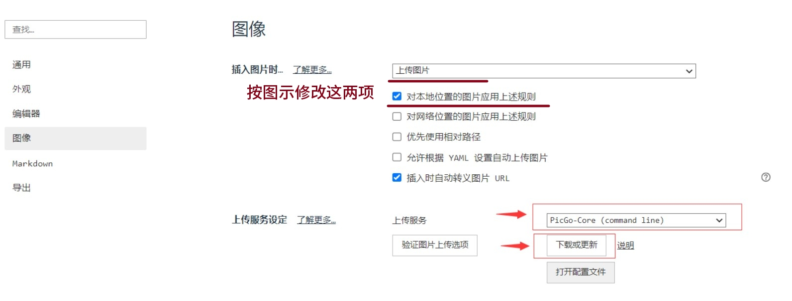

上一步完成之后，点击**「打开配置文件」**，然后将自己的图床信息填写进去

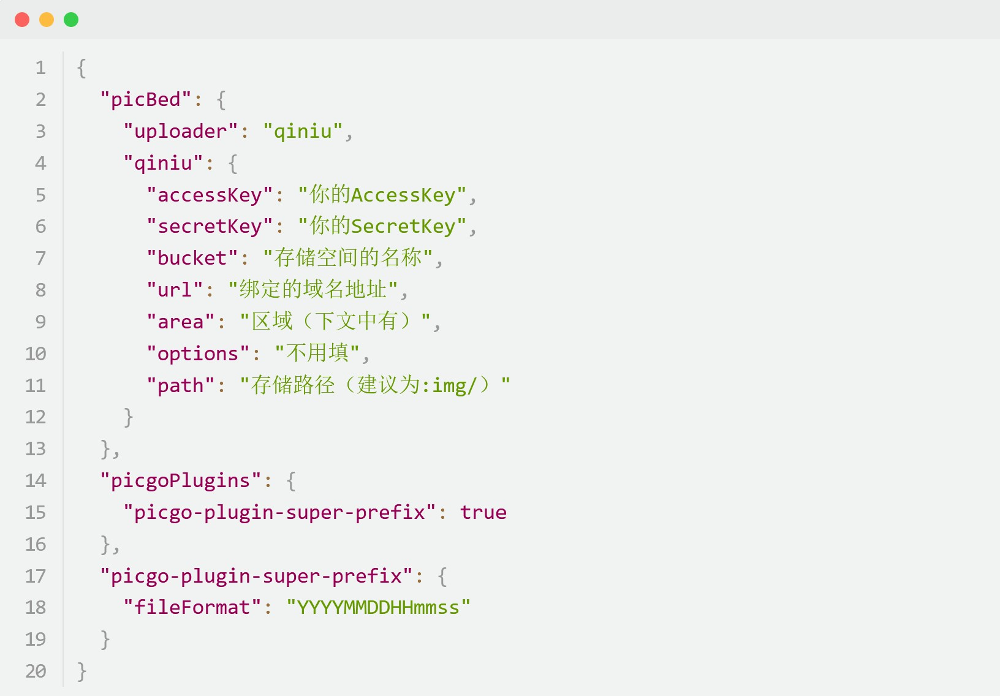

**到此，配置结束。**

接下来可以去到 Typora 里面，加载一张图片试试，如果小括号内的**本地位置**自动变成了**「你的云存储域名地址 + 图片文件名」**，并且图像能够显示，就表示没问题了。

