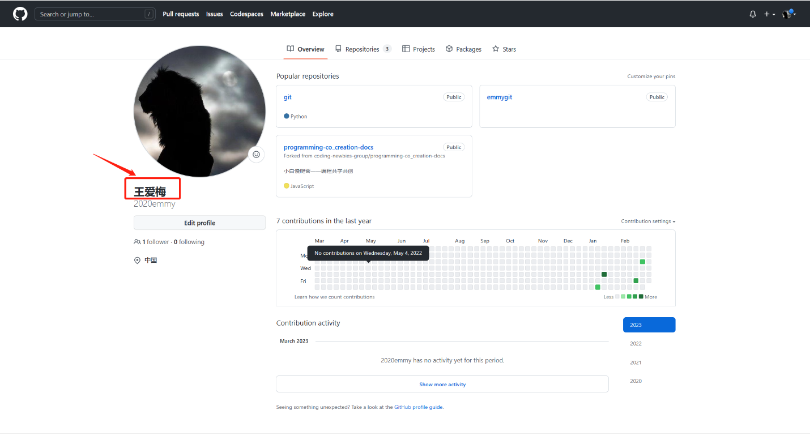

# GitHub修改用户Name教程

## 1. 登录个人GitHub

**网址：**[GitHub](https://github.com/)

## 2. Sign In ，输入用户名和密码

## 3. 点击网页右上角的头像，出现用户名，点击Edit profile

## 4. 修改用户Name，跟Mixin保持一致，Save

## 5.修改用户Name，跟Mixin保持一致，Save

