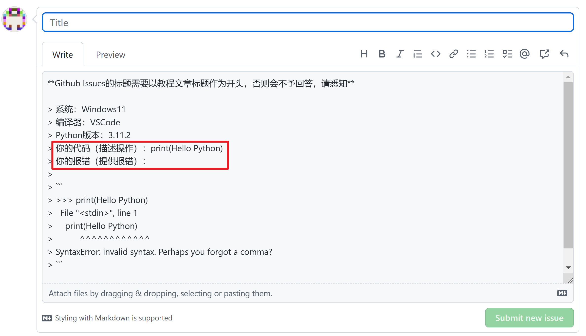

:::info 信息

[视频](https://www.bilibili.com/video/BV1V24y1H73p/?vd_source=4a888db8814702b2062fcaf2575be745)
:::

## Github Issues提交规范

- Github Issues以文章标题开头，否则将不予回复；

- 相同问题不要在多个Github Issues中提交；

- 问题得到解决后，请Issues创建者关闭Issues，整个过程闭环。

## 不知道怎么描述问题怎么办？

如上图，我们对于Issues提供了模板，模板中要求填写你做了什么，遇到问题的现象是什么？

新手，很可能没有办法描述自己的问题，这是正常的，知道自己卡在哪了，通常，问题也就接近解决了。

所以，你只需要描述你在教材的那部分遇到了问题，然后描述你做了什么，问题的现象是什么，至于问题到底是什么，由解答问题人去判断。
