:::info 信息

[视频](https://www.bilibili.com/video/BV18s4y1j7KQ/?vd_source=4a888db8814702b2062fcaf2575be745)
:::

## 1.安装python

### 1.1.Windows

1. 访问 [Python官方下载页面](https://www.python.org/downloads/)，然后直接点击“Download Python 3.11.2”开始下载Python安装包：


2. 点击另存为，将Python安装包保存在电脑上，比如选择“桌面”：


3. 如果系统弹出如下提示，选择运行即可：

   


4. 注意：勾选“Add python.exe to PATH”，这项默认是不勾选的，然后点击“Install Now”，开始安装Python：

   

5. 点击“Disable path length limit”，然后点击右下角的“Close”：

   

### 1.2.Mac

> Mac 上默认已安装了 Python 2.7,我们共学需要用  Python 3以上版本
> 推荐新手先使用最简单的图形化安装，后面进阶后可探索命令行的安装方式

1. 查看当前 Python 版本，可以在终端（Terminal）中输入命令`python --version`，执行结果：`Python 2.7.18`返回的是系统当前的版本

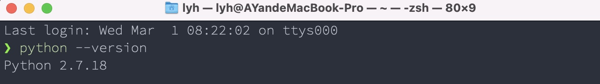


2. 访问 [Python官方下载页面](https://www.python.org/downloads/)，一般会自动识别当前计算机系统合适的安装版本，直接点击“Download Python 3.11.2”就可以了。也可以点击“macOS”查看更多版本，自行选择。


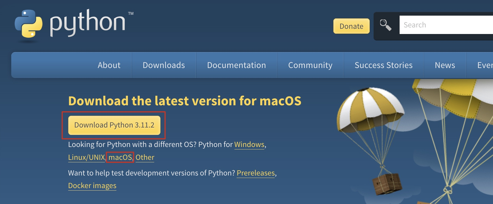

3. 开始下载Python安装包，安装包会自动默认保存在下载文件夹或你已设置过的默认下载路径下。

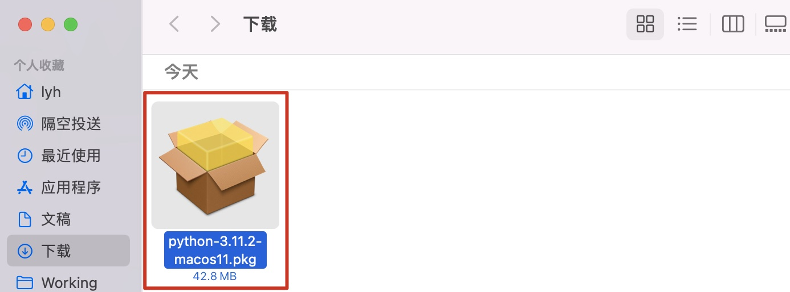

4. 双击安装包（后缀名为.pkg的文件），进入 Python 安装向导，然后按照向导一步一步点击“继续”，弹出软件许可协议中条款时，点击“同意”，最后点击“安装”“关闭”即可。

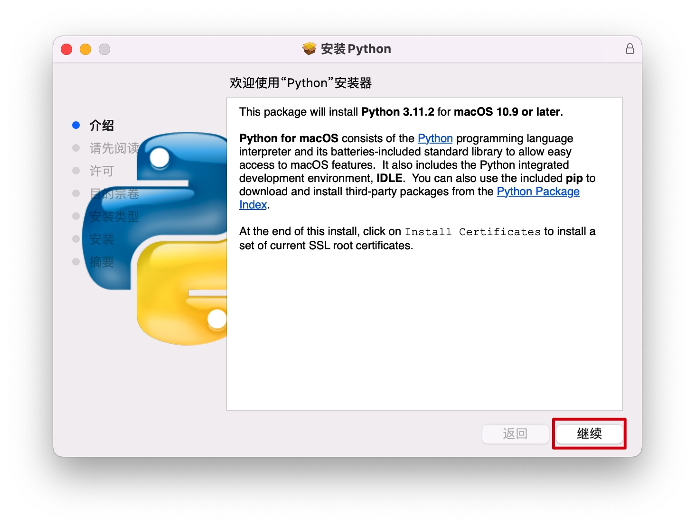

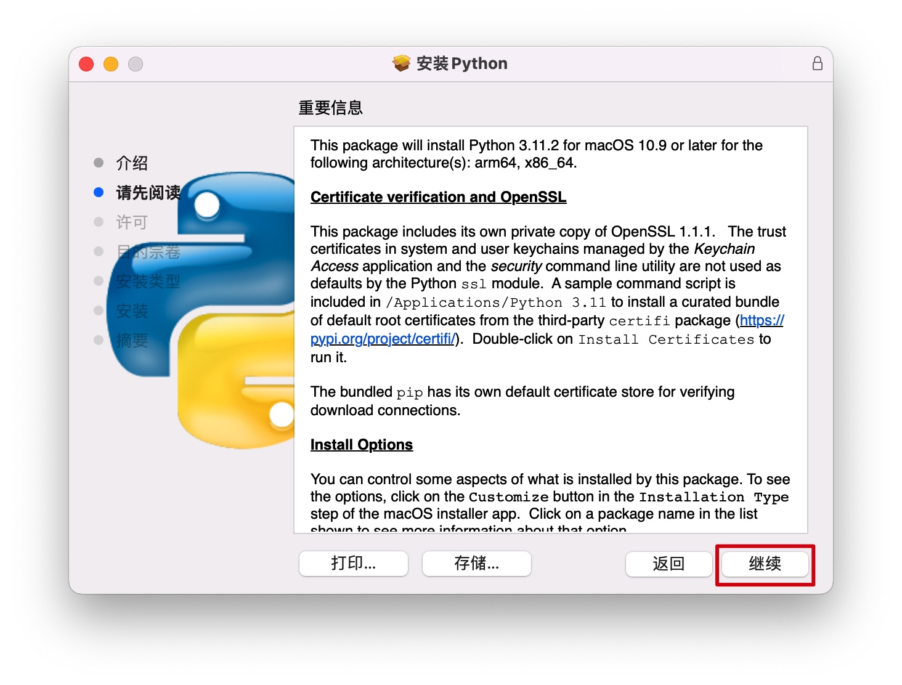

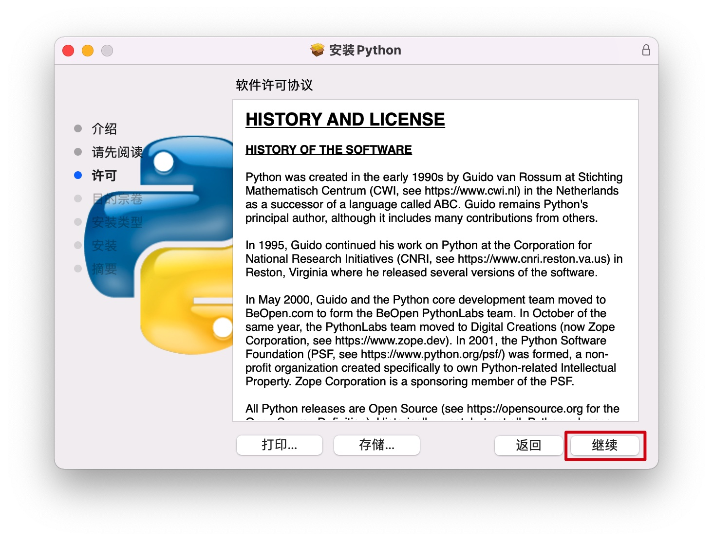

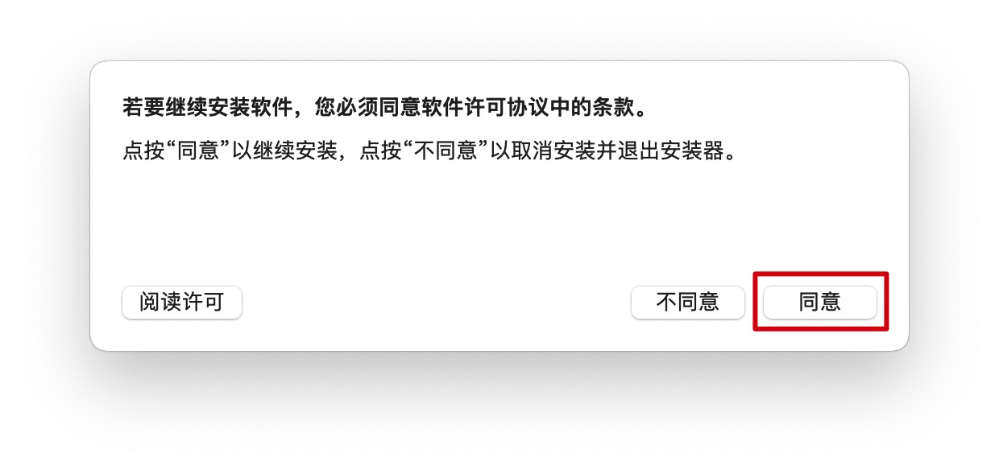

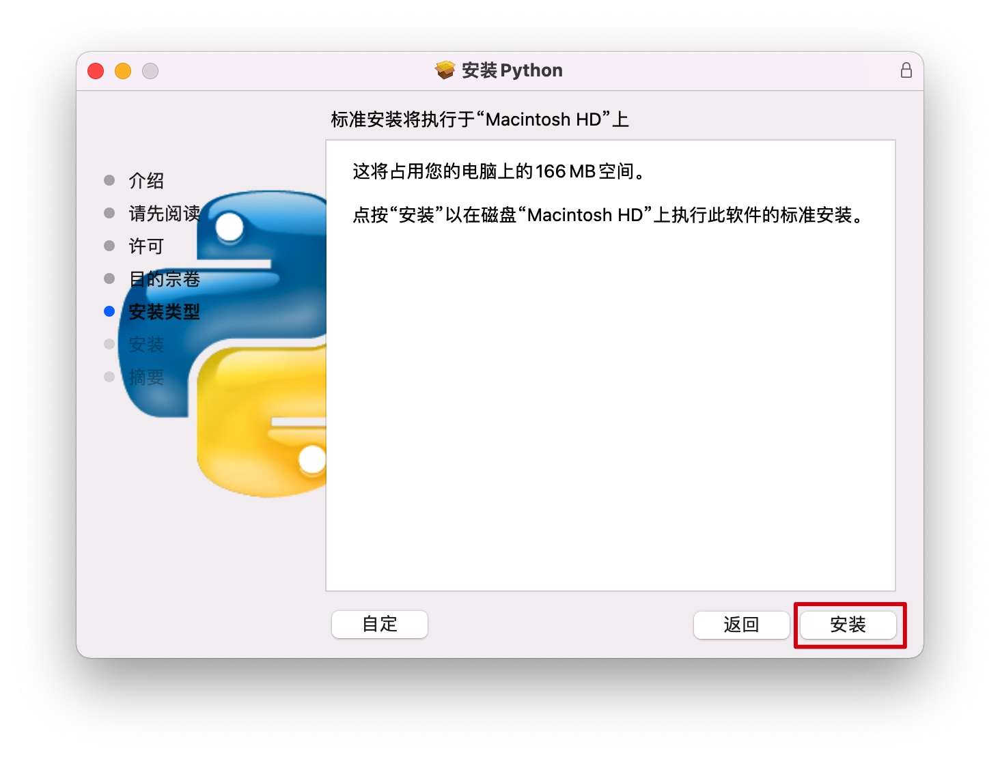

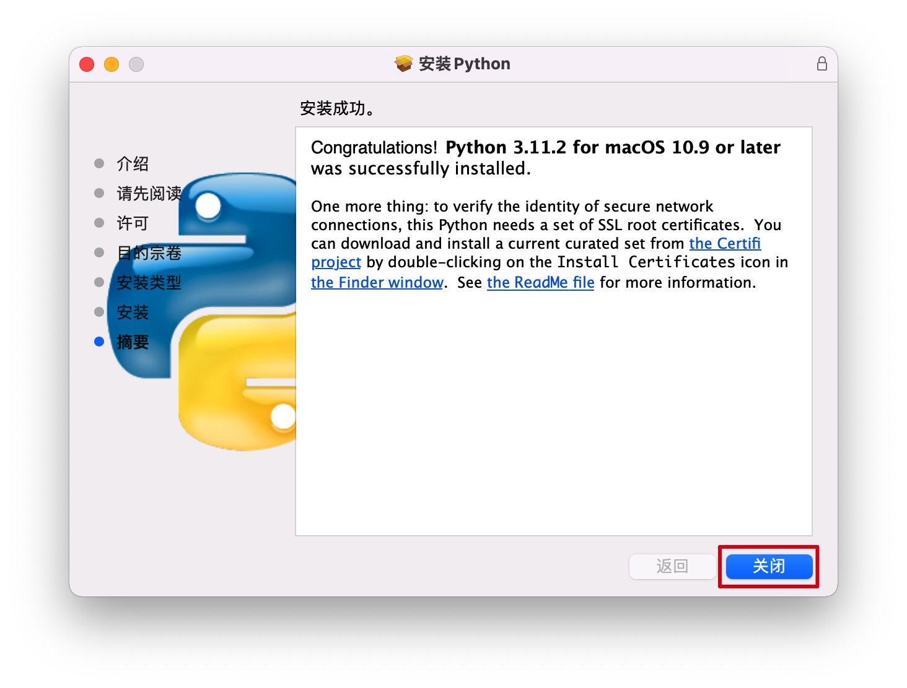

5. 关闭后系统会弹出窗口询问你是否保留软件包，按需选择即可（我一般会保留作为记录，以便后续查询回顾自己的操作，新手一般都会有一段迷糊期，哈）
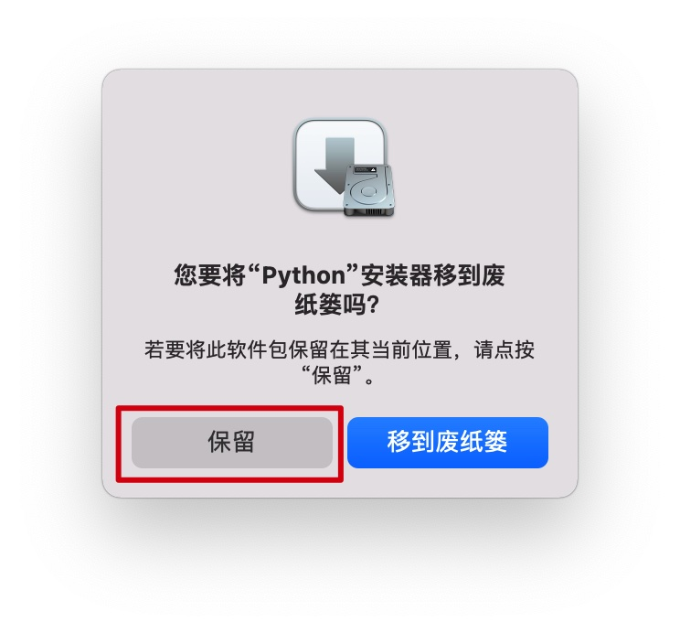

6. 在终端（Terminal）中输入命令`python3 --version`验证是否安装成功
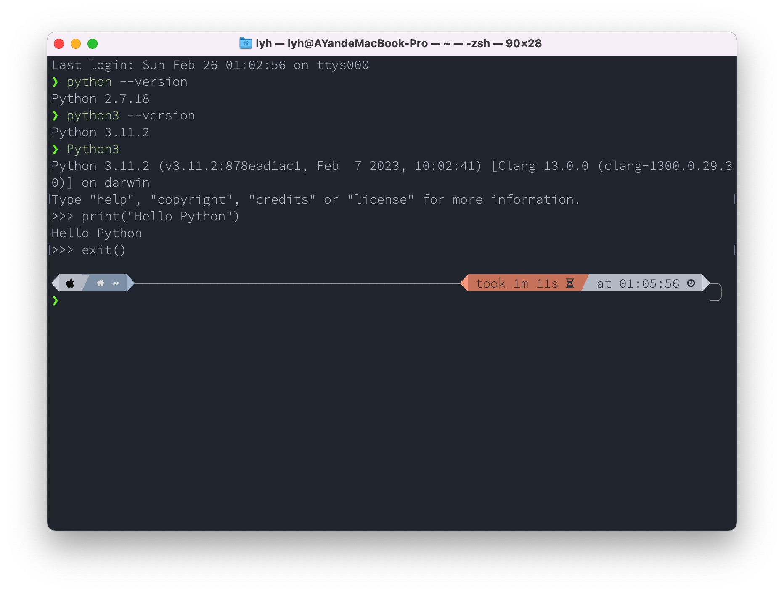

执行结果：`Python 3.11.2`返回的是系统当前的版本

输入命令 `Python3`，进入了`Python3`解释器，可以编写简单的代码`print("Hello Python")`
>注意：如果输入的是`Python` 则进入的是`Python2`

输入命令 `exit()`退出编程环境


## 2.在终端中打开Python

打开Windows PowerShell，输入`py`，进入Python

```powershell
py
```


接着输入下面的内容，让Python在终端中“打印”出“Hello Python”：

``` python
print("Hello Python")
```


再试试下面的命令，“见识”一下一个错误的输入，Python的报错是什么样的，好像没什么可怕的

```python
print(Hello Python)
```


最后，我们输入下面的命令，退出Python终端，但仍然在PowerShell终端中，请注意观察区别：

```python
exit()
```


好了，后面就可以开始我们编程课的正式学习了。