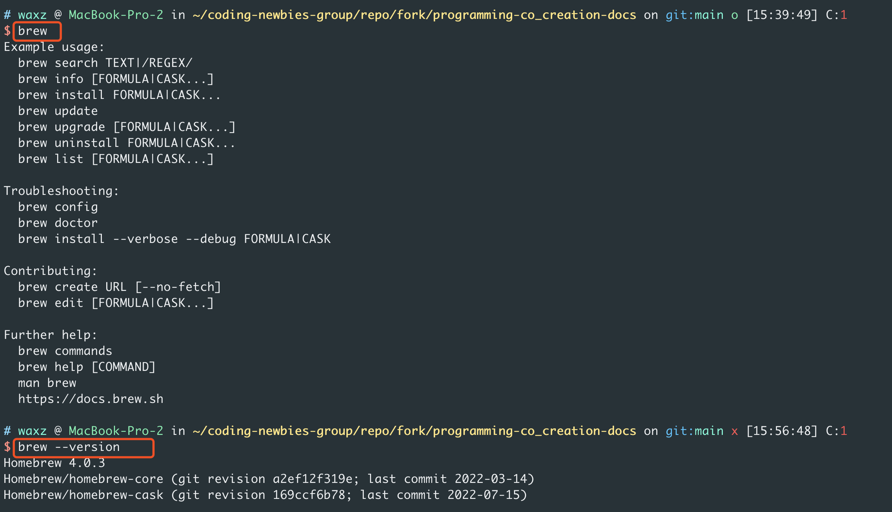
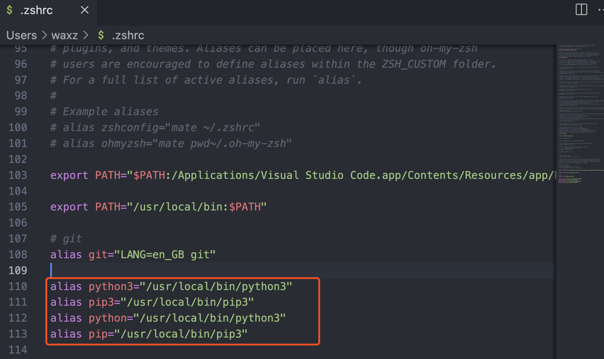
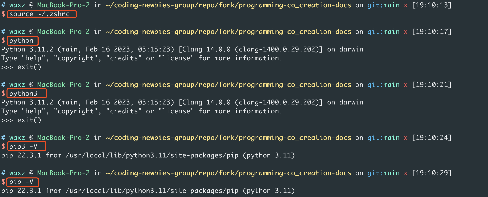

## 1.安装python

### 1.1.Windows

1. 访问 [Python官方下载页面](https://www.python.org/downloads/)，然后直接点击“Download Python 3.11.2”开始下载Python安装包：


2. 点击另存为，将Python安装包保存在电脑上，比如选择“桌面”：


3. 如果系统弹出如下提示，选择运行即可：

   


4. 注意：勾选“Add python.exe to PATH”，这项默认是不勾选的，然后点击“Install Now”，开始安装Python：

   

5. 点击“Disable path length limit”，然后点击右下角的“Close”：

   

### 1.2.Mac

1.使用Terminal安装homebrew。homebrew是一个在macOS平台的包管理软件，它提供了简便的方式来安装软件和工具，并且能对软件的安装、更新、卸载进行管理。
首先看下目前电脑里是否已安装了homebrew，在Terminal终端里输入brew，提示未找到则表示电脑里目前没有homebrew：


若已安装homebrew，在输入brew时会给出brew的使用示例，输入brew --version则会展示当前homebrew的版本号。电脑已安装homebrew的话，就可以跳过第2步，直接进入第3步流程


2.输入/bin/bash -c "$(curl -fsSL https://raw.githubusercontent.com/Homebrew/install/HEAD/install.sh)"来完成homebrew的安装


3.电脑里有了homebrew后，用homebrew这个包管理软件来进行git的安装，在Terminal输入brew install python
这条命令会安装homebrew源当前最新的Python版本Python3.11.2


4.macOS系统会预装一个Python2.X版本，系统内的一些工具和脚本会依赖Python2.X，所以建议你不要去修改Python2.X。
用code ~/.zshrc编辑~/.zshrc配置文件，将python和python3设置别名为"/usr/local/bin/python3"，将pip和pip3设置别名为"/usr/local/bin/pip3"，说明下设置别名的目的是希望之后在Terminal里使用python和python3时都指向使用python3.11，在Terminal里使用pip和pip3时指向使用python3.11对应的pip3工具，pip是python自带的支持对python第三方库进行安装、卸载的工具
> alias python3="/usr/local/bin/python3"

> alias pip3="/usr/local/bin/pip3"

> alias python="/usr/local/bin/python3"

> alias pip="/usr/local/bin/pip3"


编辑完成后，在Terminal里输入source ~/.zshrc使得配置生效，之后再输入python或python3都能正常进入python3.11.2的交互式命令行


## 2.在终端中打开Python

打开Windows PowerShell，输入`py`，进入Python

```powershell
py
```


接着输入下面的内容，让Python在终端中“打印”出“Hello Python”：

``` python
print("Hello Python")
```


再试试下面的命令，“见识”一下一个错误的输入，Python的报错是什么样的，好像没什么可怕的

```python
print(Hello Python)
```


最后，我们输入下面的命令，退出Python终端，但仍然在PowerShell终端中，请注意观察区别：

```python
exit()
```


好了，后面就可以开始我们编程课的正式学习了。