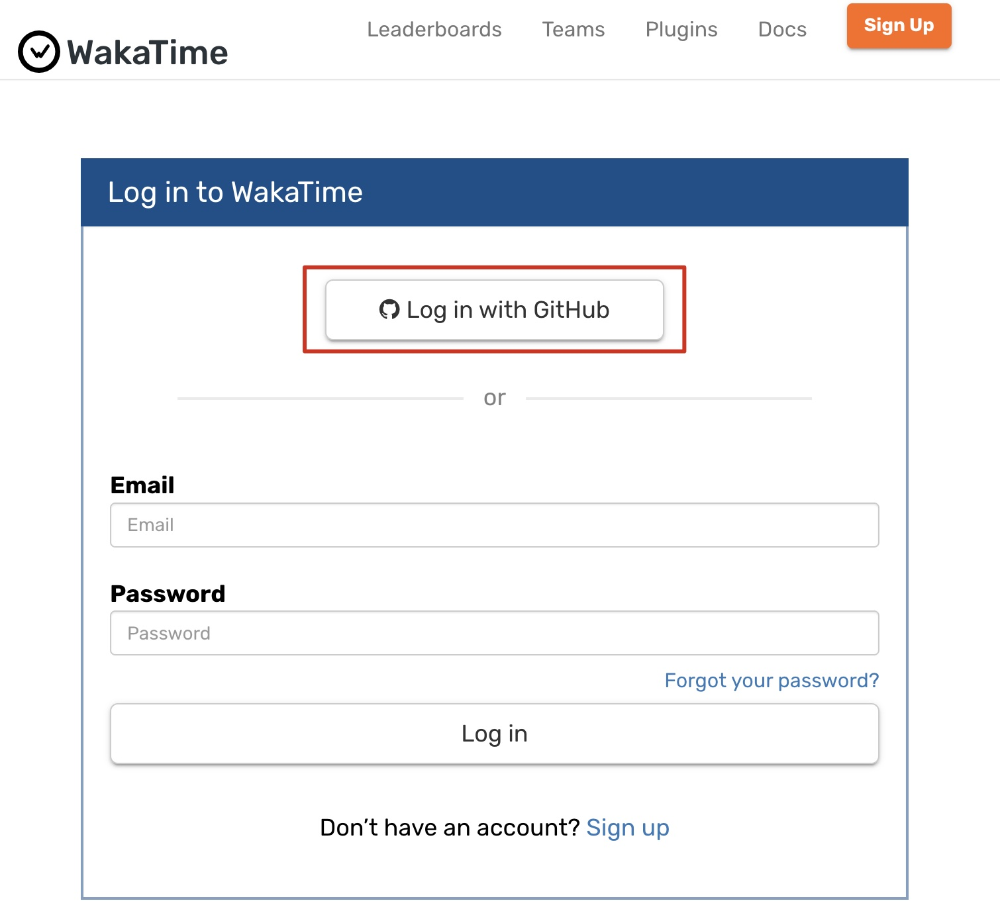
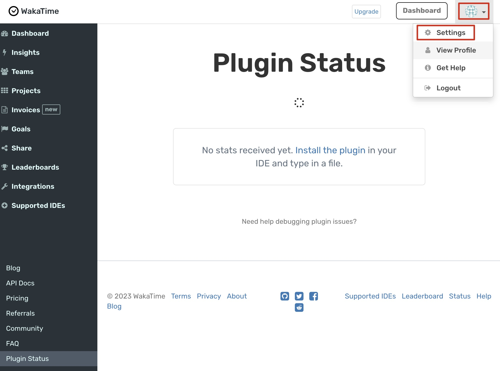
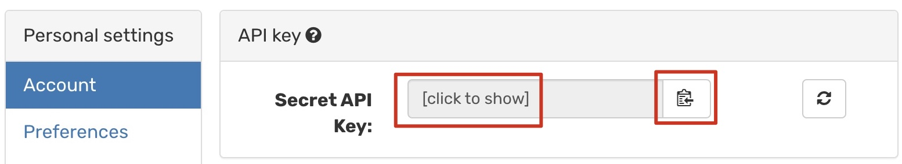
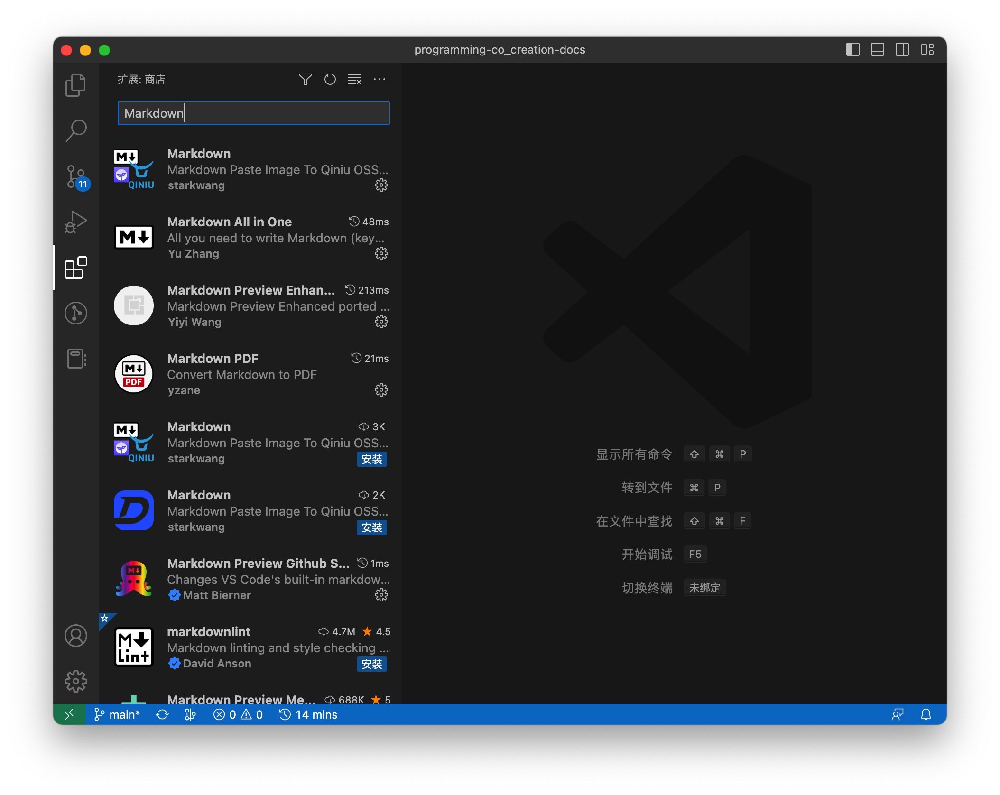

:::info 信息
[视频](https://www.bilibili.com/video/BV1YM411j7FJ/?vd_source=4a888db8814702b2062fcaf2575be745)
:::


## 1.什么是IDE

下面是维基百科关于IDE的中文释义：

> 集成开发环境（Integrated Development Environment，简称IDE，也称为Integration Design Environment、Integration Debugging Environment）是一种辅助程序开发人员开发软件的应用软件，在开发工具内部就可以辅助编写源代码文本、并编译打包成为可用的程序，有些甚至可以设计图形接口。

简单说，就是我们平时写代码的“地方”。

在我们后面我们使用VSCode作为我们的IDE。VSCode是一款开源的，使用广泛的IDE，支持很多第三方插件，可以让VSCode更好的适用于特定的编程环境。

## 2.安装VSCode

1. 进入VSCode的 [下载页面](https://code.visualstudio.com/Download) ，点击红色方框内的“Windows”下载样式的按钮：

   


2. 页面会自动跳转，并弹出下载窗口，点击另存为，将VSCode的安装包保存到本地，比如，保存到桌面：

   

3. 打开安装包，一路下一步，按默认选项安装，在这里，着重强调一下，下面红框的内容要确保勾选，其中最后一项决定着我们可以在命令行中，通过命令`code .`，将当前目录，用VSCode打开：

   


## 3.在VSCode中编写，运行Python代码

1. 在命令行中执行下面的命令：

   假如，你有D盘，你的D盘有一个名为projects的文件夹.....，如果没有，请换成别的文件夹

   ```powershell
   cd d:\projects\
   mkdir learn-python
   cd learn-python
   code .
   ```

   

2. 然后，我们就用VSCode打开了learn-python这个文件夹：

   

3. 我们新建一个文件，名为main.py:

   

4. 页面底部会要求我们选择“Interpreter”编译器，然后选择页面顶部弹出的Python 3.XX.X：

   > 有同学提示他们看不到底部的选择“Interpreter”的提示，说是因为安装了Python的扩展才会看到，大家可以按照下图，再VSCode左侧，找到扩展，然后搜过python，安装一下Python的VSCode扩展，这样VSCode会更好的支持Python这种语言。
   > 

   

5. 下面，我们把 《[6.第一段Python代码](../p0/p0-6-python.md)》 一课中的代码用VSCode再写一遍，执行一遍：

   在代码编写的区域键入`print("Hello Python")`，点击右上角的“”运行按钮，可以在页面底部看到代码运行的结果：Hello Python

   


## 作业

这一篇，我们留个作业，把前面已经涉及过的Python代码，原来在PowerShell中，通过Python解释器直接运行的代码，在VSCode中再试一次。

``` python
42
3.14
'a'
'abracadabra'
True
False
```

请将结果，VSCode结果截图回复到该Github Issues中：[作业：1-3-IDE集成开发环境 · Issue #27](https://github.com/coding-newbies-group/programming-co_creation-docs/issues/27)

## 4.VSCode插件
从这一篇，我们就正式开启了使用VSCode编写代码的学习和应用。前面提到“VSCode支持很多第三方插件“，这里列出几款适合目前共学共创的插件工具供大家参考：

>大家也可以自行探索，发现好的插件请继续补充进来
### 4.1 Wakatime
[Wakatime](https://wakatime.com/)是一款给程序员们解决编程工作时间自动追踪统计的工具，支持非常多的编辑器，可以点击官网了解详情。
在[Login - WakaTime](https://wakatime.com/login)注册账户，我们可以使用GitHub账号登陆。




如果GitHub账号在浏览器中是登陆状态会自动识别，点击绿色按钮进行授权
> 框出来的蓝色字体`WakaTime`是GitHub仓库，可以点击看一下


跳转到以下页面，点击右上角的设置图标，点击`Settings`




跳转页面并弹出验证邮箱提示，点击`Send confirmation email`发送验证邮件


你的邮箱会收到一封验证邮件，在验证邮件中点击`Confirm your email`


浏览器跳转到以下页面，点击`Install the editor plugin`安装编辑器插件


在这个页面中我们可以看到有非常多的编辑器都可以安装使用Wakatime


打开编辑器（我们以[VSCode](https://wakatime.com/vs-code)为例子）安装插件之前，我们需要先获取ApiKey
右上角的设置图标，点击`Settings`在account->API Key中点击`[click to show]`后现现一串API Key，再点击copy



打开VScode，点击左边工具栏的应用图标，在搜索框中输入`Wakatime`，确认是我们需要的插件后，点击`Install`安装


安装完成后会显示Disable(禁用)和Uninstall(卸载)
>注意，不需要点击这2个按钮，只是确认已成功安装

在自动弹框中将刚才复制的那串API Key复制到这里，按回车键。至此，Wakatime就安装好了，VSCode下方已出现了时间图标，它会默默地为你自动统计工作时间。


点击时间图标，会跳转到Wakatime网页，在Dashboard面板就可以查看你的工作统计图表啦。


随着你的工作时间和种类的增加，这些图表会变得非常漂亮，让你编写代码时的心情变得更愉悦，当然，最重要的是你可以用这些反馈数据做复盘等。


下图是我的VSCode界面，实现了
- 一边编辑Markdown语法一边预览Markdown渲染效果
- 清晰地看到项目中哪些文件有变化（U-git未跟踪，M-有更新）


这2个效果是通过安装`Instant Markdown`和`GitLens`插件实现的，请参考以上在VSCode安装插件的方式，自行探索安装。


可以搜索更多插件熟悉安装，安装后不合适可以随时点击Disable(禁用)或Uninstall(卸载)，欢迎分享补充好用的插件。

